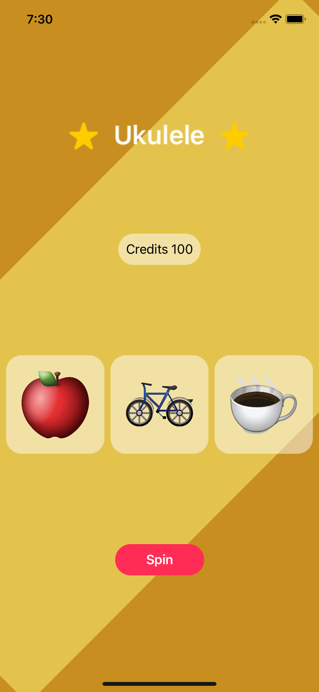

<div>
  <h1 align="center">SwiftUI Slots</h1>
  <h4 align="center">
    A Slots Game to learn SwiftUI
  </h4>
</div>

<div align="center" style="display: block; text-align: center;">
  
</div>

## Motivation

As part of my Swift Learning Journey, I'm writing this SwiftUI application
following [CodeWithChris][1] tutorials.

## Running Locally

1. Clone this repositoy using Git

```bash
git clone https://github.com/EstebanBorai/swiftui-slots.git
```

2. Open the project with Xcode, this project was written using Xcode 12.5.1.

3. Run the simulator using the Play button on top.

## Contributions

If you find space for any possible contribution feel welcome to open a PR or
issue to ask any questions.

[1]: https://www.youtube.com/channel/UC2D6eRvCeMtcF5OGHf1-trw
